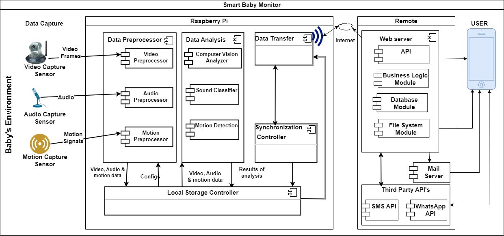

# Raspberry Subsystem

This consists of the modules and routines that will run on the raspberry pi to capture, process and transmit data and files.
This is part of the Smart Baby Monitor, A system to help parents and infant care takers
to monitor thier babies.

## Tabble Of Contents

1. [Introduction](#introduction)
2. [Installation](#installation)
3. [Database](#database)

### Introduction

As said earlier this sub system does the data capture by use of Camera, Microphone and Motion sensors.
It also does the analysis to derive insights for the captured data.
Finally it ensures that any new data is sent to teh remote server
Figure Below Shows the Architecture Of the smart baby monitor.


## Installation

It pretty easy to set up this system

### Requirements

- Raspberry Pi 4 Model B
- Raspberry OS
- Python 3 with Pip
- Raspberry Pi Camera
- USB Microphone
- PiR Motion Sensor

### Installation Steps

#### Step 1

Clone the Repository from the server

```sh
git clone https://github.com/Smart-Baby-Monitor/raspberry-subsystem.git

```

Then go to the project directory

```sh
cd  raspberry-subsystem
```

#### Step 2

Now you need to install the dependencies
This will as well set up the scripts that capture and send data as well as sync data to run on start up

In the turminal run the install script

```sh
./install.sh
```

Congrats!! You've just set up the system

#### Step 3

Now you can configure the system to communicate with the server for data send and synchronization. Also to allow remote controll via the web application

#### Database

A simple out of the box database system is used. We chose sqlite because of it's simplicity and it can run without a server.
Database logic is implemented in the both utils.py and models.py. Details about these files follow.

### utils.py

This script contains generic utilities that can be used anywhere in the application.

#### DbAccess

One of these utilities is the DbAccess class. Just like the name suggests it used to access databases. and It was optimized for SQLite database.

Here is the pseudo code of how it's implemeted. Much as it's not a concrete implementation this pseudo code helps you get an overview.

```py
class DbAccess:
    def __init__(self, debug=False):
        pass

    def update(self, table, data, where):
       return int|str
    def sql(self, sql: str):
        return True|False
    def insert(self, table, data):
        return int | Str

    def select(self, table: str, columns: list = [], where: dict = {}):
        return array | False

```

#### Migration

In addition there is another class call Migration. This class has the defitions of all the tables.
In case you want to add a new table or make any hanges to existing tables this is where you edit.
It has the following structure

```py
class Migration:
    def __init__(self, db: DbAccess):
        self.db = db
        pass

    def migrate(self,):

        table_schemas = self.tables()
        for schema in table_schemas:
            try:
                self.db.sql(schema)
            except Exception as e:
                print("Exception", e)

        pass

    def tables(self,):
        return [
            # A list of table schemas
             ]


```

#### models.py

This script contains models.
The concept of models is to abstract the tables in the database i.e models create a layer that makes it not necessary to know how the tables were created or their structures i.e the column names.
These models provide methods that can help you access these column values by just calling methods.
We shall talk about each model in details below

#### Model

This is the root/parent or base class which must be extended by all models. This implements most of the primitives such as selct, update, insert. It leverages the power provided by the DbAccess class (Discussed above)

```py
class Model:

    def __init__(self, id=""):
        pass
    def getId(self):
        pass

    def select(self, columns, where):
        pass

```
